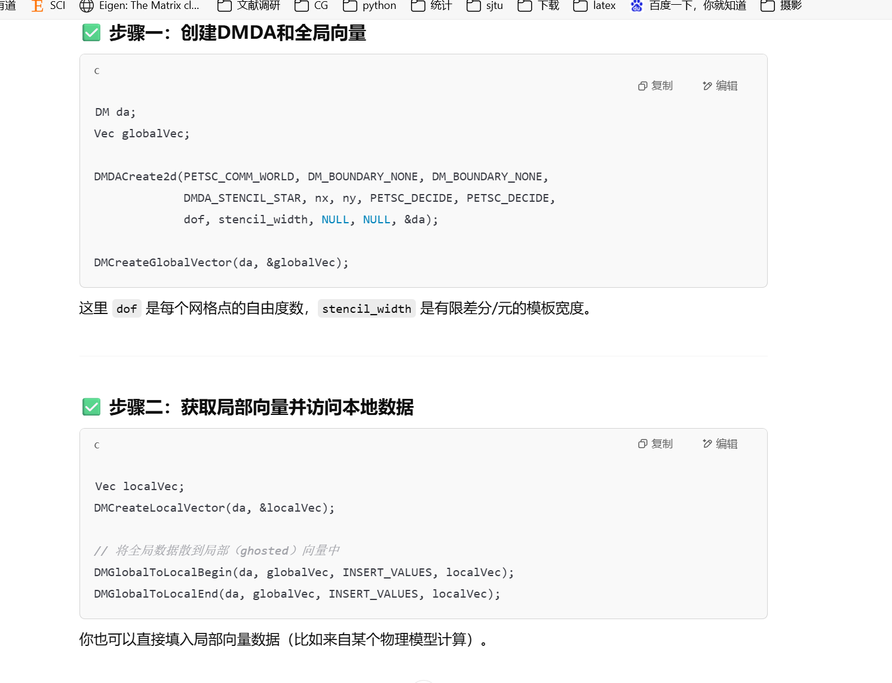
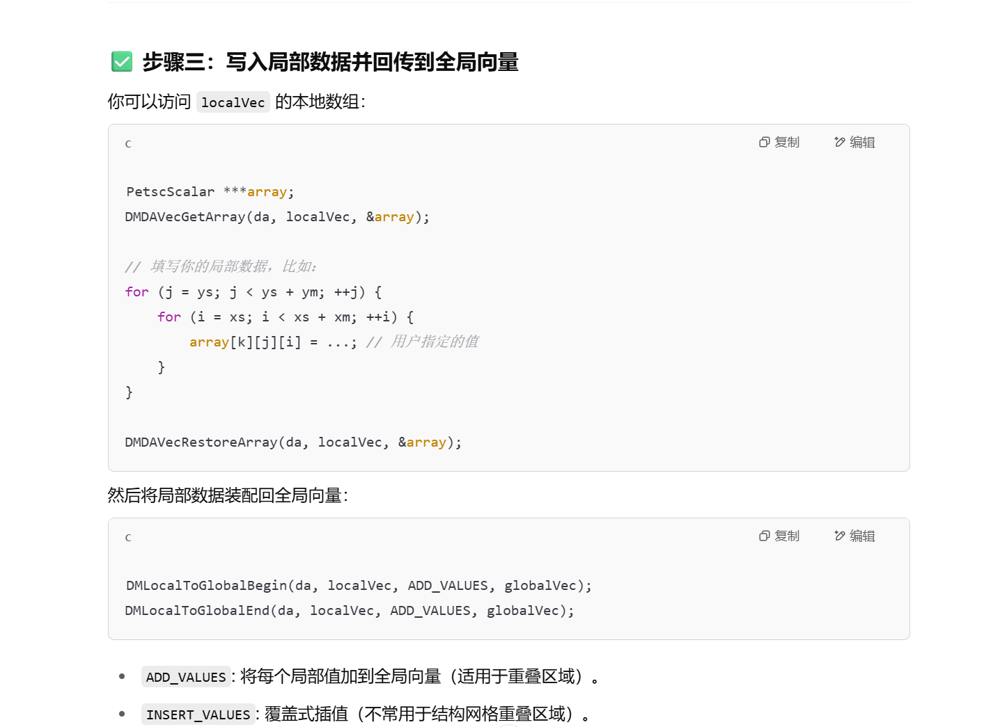
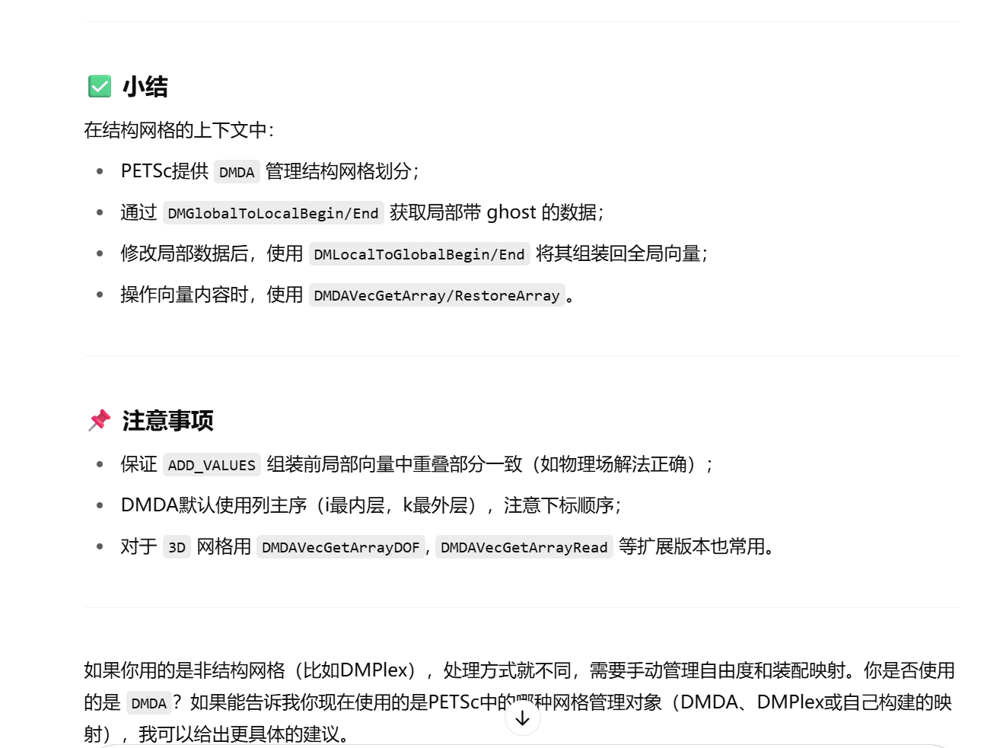

运行命令：
mpiexec -n 2 ./main -ksp_type cg -da_refine 6 -ksp_converged_reason -ksp_rtol 1e-10 -pc_type asm -pc_asm_overlap 4 -sub_pc_type icc
# 代码内容
有限元 

# 局部向量->全局向量

# 经验总结
本程序将有限元刚度矩阵、载荷向量的组装以及Dirichlet边界条件的处理整合在了一起，可以尽可能减少重复计算。并且避免了程序learnPETSC12中单独处理Dirichlet计算时面临的进程间通讯，和多线程错误。

基于分布式存储的结构网格组装刚度矩阵较为简单，直接按使用函数 `MatSetValuesStencil` 即可，但是对于载荷向量的组装，对于“累加”和 “值插入” 要分两种方法进行组装，对于“值插入”，可直接遍历区域的边界点，直接使用 

`DMDAVecGetArray(da,b,&abInsert)` -> `abInsert[j][i]= user->g_Dir(x,y);` -> `PetscCall(DMDAVecRestoreArray(da,b,&abInsert));` 

进行赋值，注：此时不能使用局部向量到全局向量的方式，因为在结构网格下，填充模式 “INSERT_VALUES” 不可用；

对于“累加”的网格点，因此时涉及ghost点，则可选择先构造局部向量再填充到全局向量中的模式，具体实现如下：

`Vec localVecAdd;` -> `PetscCall(DMCreateLocalVector(da,&localVecAdd));` -> `PetscReal **abAdd` 
-> `PetscCall(DMDAVecGetArray(da,localVecAdd, &abAdd));`  -> `abAdd[jtest][itest] -= boundVal*GaussIntegral(IntFunMat,hx,hy,user->quadpts);` -> `PetscCall(DMDAVecRestoreArray(da,localVecAdd,&abAdd));` -> `PetscCall(DMLocalToGlobalBegin(da,localVecAdd, ADD_VALUES, b)) ;PetscCall(DMLocalToGlobalEnd(da,localVecAdd, ADD_VALUES, b));`