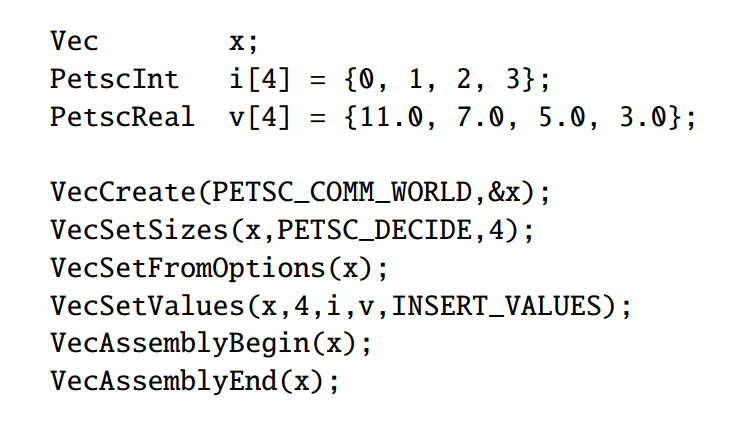
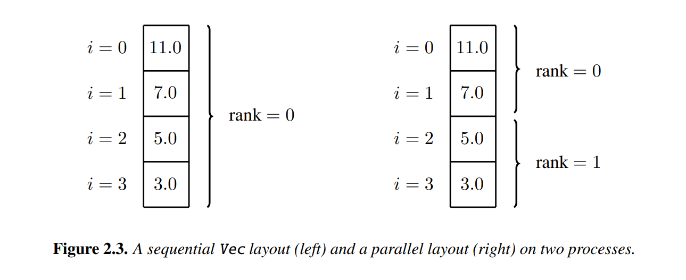
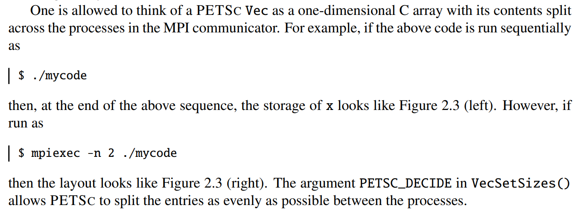
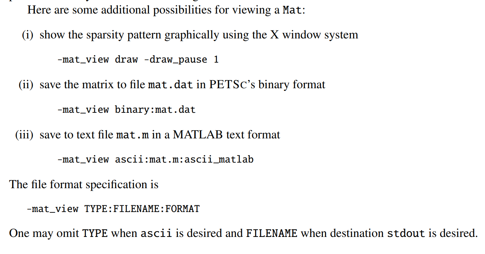

# 代码内容
学习PETSC库的矩阵和向量设置
## 笔记
1. 在计算机上进行数值计算时，求解 $\bm Au=b$ 时，误差只能达到 \(O(k(A)\epsilom)\)，其中 \(k(A)\) 为条件数

2. <MatSetFromOptions> 函数的作用是从 PETSc 的选项系统中读取与矩阵相关的配置，并将这些配置应用到矩阵对象上。

支持的选项：

MatSetFromOptions 可以处理的选项包括（但不限于）：

矩阵类型：例如 -mat_type，用于指定矩阵的类型（如 aij、baij、sbaij 等）。

矩阵存储格式：例如稀疏矩阵的存储格式（如 CSR、CSC 等）。

预分配大小：例如 -mat_aij_allocation，用于设置稀疏矩阵的非零元素预分配大小。

并行设置：例如 -mat_partitioning_type，用于设置矩阵的并行分区方式。

其他矩阵属性：如是否对称、是否正定等。
3. 在运行该程序时，使用 <-mat_view> 可查看矩阵；使用 <-mat_view ::ascii_dense> 可用稠密形式输出
4. 一些其他的运行命令

