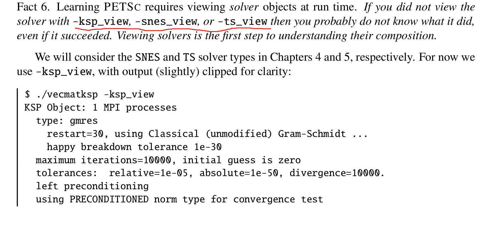

# 代码内容
线性方程组求解

# 笔记
1. `KSPSetOperators(ksp,A,A)` ：其中第一个 $A$ 定义了线性算子；第二个 $A$ 表示在运行时会使用 preconditioner 
2. 都设置好后，使用 `KSPSolve(ksp,b,x)` 求解线性方程组
3. `PetscCall(VecSetValues(b,4,j,ab,INSERT_VALUES));` 中的`INSERT_VALUES`表示将提供的值直接插入到向量的指定位置，覆盖该位置原有的值。
4. 
5. KSP solver 默认使用 restart 为 30 的 GMRES 方法求解
3. 若不想使用迭代法，可用命令： `$ ./main -ksp_type preonly -pc_type lu` 直接法求解，其中 preonly 的意思是仅执行预条件